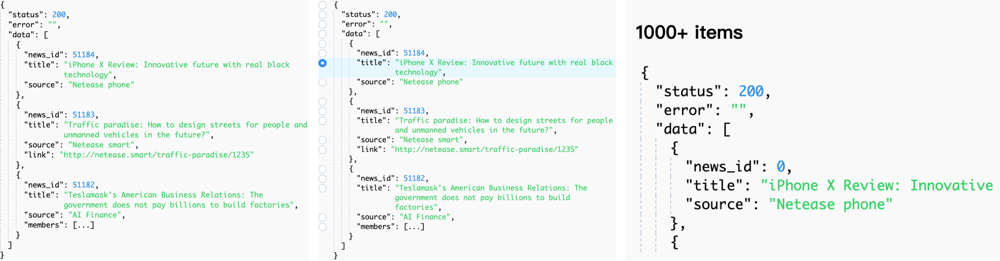

<p align="center">
  <a href="https://github.com/leezng/vue-json-pretty">
    
  </a>
</p>

<h1 align="center">
  <a href="https://github.com/leezng/vue-json-pretty" target="_blank">Vue Json Pretty</a>
</h1>

<div align="center">

<p>A Vue component for rendering JSON data as a tree structure.</p>
<p>Now it supports Vue3 at least. If you still use Vue2, see <a href="https://github.com/leezng/vue-json-pretty/tree/1.x">1.x</a>.</p>

[](https://travis-ci.org/leezng/vue-json-pretty)
[](https://www.npmjs.org/package/vue-json-pretty)
[](https://github.com/leezng/vue-json-pretty/blob/master/LICENSE)
[](https://bundlephobia.com/result?p=vue-json-pretty)
[](https://www.npmtrends.com/vue-json-pretty)
[](https://github.com/leezng/vue-json-pretty/issues)

</div>

[](https://github.com/leezng/vue-json-pretty)

English | [简体中文](./README.zh_CN.md)

## Features

- As a JSON Formatter.
- Written in TypeScript, support `d.ts`.
- Support get item data from JSON.
- Support big data.
- Support editable.

## Environment Support

- Modern browsers, Electron and Internet Explorer 11 (with polyfills)
- Server-side Rendering

| [](http://godban.github.io/browsers-support-badges/)</br>IE / Edge | [](http://godban.github.io/browsers-support-badges/)</br>Firefox | [](http://godban.github.io/browsers-support-badges/)</br>Chrome | [](http://godban.github.io/browsers-support-badges/)</br>Safari | [](http://godban.github.io/browsers-support-badges/)</br>Electron |
| --------------------------------------------------------------------------------------------------------------------------------------------------------------------------------------------------------------- | ----------------------------------------------------------------------------------------------------------------------------------------------------------------------------------------------------------------- | ------------------------------------------------------------------------------------------------------------------------------------------------------------------------------------------------------------- | ------------------------------------------------------------------------------------------------------------------------------------------------------------------------------------------------------------- | --------------------------------------------------------------------------------------------------------------------------------------------------------------------------------------------------------------------- |
| IE11, Edge                                                                                                                                                                                                      | last 10 versions                                                                                                                                                                                                  | last 10 versions                                                                                                                                                                                              | last 10 versions                                                                                                                                                                                              | last 2 versions                                                                                                                                                                                                       |

## Using NPM or Yarn

```bash
$ npm install vue-json-pretty --save
```

```bash
$ yarn add vue-json-pretty
```

## Use Vue2

```bash
$ npm install vue-json-pretty@v1-latest --save
```

## Usage

The CSS file is included separately and needs to be imported manually. You can either import CSS globally in your app (if supported by your framework) or directly from the component.

```vue
<template>
  <div>
    <vue-json-pretty :path="'res'" :data="{ key: 'value' }" @click="handleClick" />
  </div>
</template>

<script>
import VueJsonPretty from 'vue-json-pretty';
import 'vue-json-pretty/lib/styles.css';

export default {
  components: {
    VueJsonPretty,
  },
};
</script>
```

## Use Nuxt.js

1. In `plugins/vue-json-pretty.js`

```
import Vue from 'vue'
import VueJsonPretty from 'vue-json-pretty'

Vue.component("vue-json-pretty", VueJsonPretty)
```

2. In `nuxt.config.js`

```js
css: [
  'vue-json-pretty/lib/styles.css'
],
plugins: [
  '@/plugins/vue-json-pretty'
],
```

## Props

| Property                 | Description ｜ Type                             | Default                                  |
| ------------------------ | ----------------------------------------------- | ---------------------------------------- | ------- |
| data(v-model)            | JSON data, support v-model when use editable    | JSON object                              | -       |
| deep                     | Paths greater than this depth will be collapsed | number                                   | -       |
| showLength               | Show the length when collapsed                  | boolean                                  | false   |
| showLine                 | Show the line                                   | boolean                                  | true    |
| showLineNumber           | Show the line number                            | boolean                                  | false   |
| showIcon                 | Show the icon                                   | boolean                                  | false   |
| showDoubleQuotes         | Show doublequotes on key                        | boolean                                  | true    |
| virtual                  | Use virtual scroll                              | boolean                                  | false   |
| height                   | The height of list when using virtual           | number                                   | 400     |
| itemHeight               | The height of node when using virtual           | number                                   | 20      |
| selectedValue(v-model)   | Selected data path                              | string, array                            | -       |
| path                     | Root data path                                  | string                                   | 'root'  |
| pathSelectable           | Defines whether a data path supports selection  | function(path, content)                  | -       |
| selectableType           | Support path select, default none               | `multiple`\|`single`                     | -       |
| showSelectController     | Show the select controller                      | boolean                                  | false   |
| selectOnClickNode        | Trigger select when click node                  | boolean                                  | true    |
| highlightSelectedNode    | Support highlighting selected nodes             | boolean                                  | true    |
| collapsedOnClickBrackets | Support click brackets to collapse              | boolean                                  | true    |
| customValueFormatter     | Custom value rendering function                 | function(data, key, path, defaultResult) | -       |
| editable                 | Support editable                                | boolean                                  | false   |
| editableTrigger          | Trigger                                         | `click` \| `dblclick`                    | 'click' |

## Events

| Event Name     | Description                              | Parameters           |
| -------------- | ---------------------------------------- | -------------------- |
| nodeClick      | triggers when click node                 | (node: NodeData)     |
| bracketsClick  | triggers when click brackets             | (collapsed: boolean) |
| iconClick      | triggers when click icon                 | (collapsed: boolean) |
| selectedChange | triggers when the selected value changed | (newVal, oldVal)     |

## Major Contributors

[](https://github.com/rchl)
[](https://github.com/blackmad)
